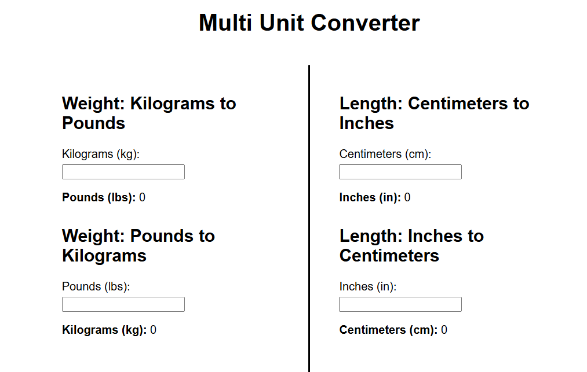
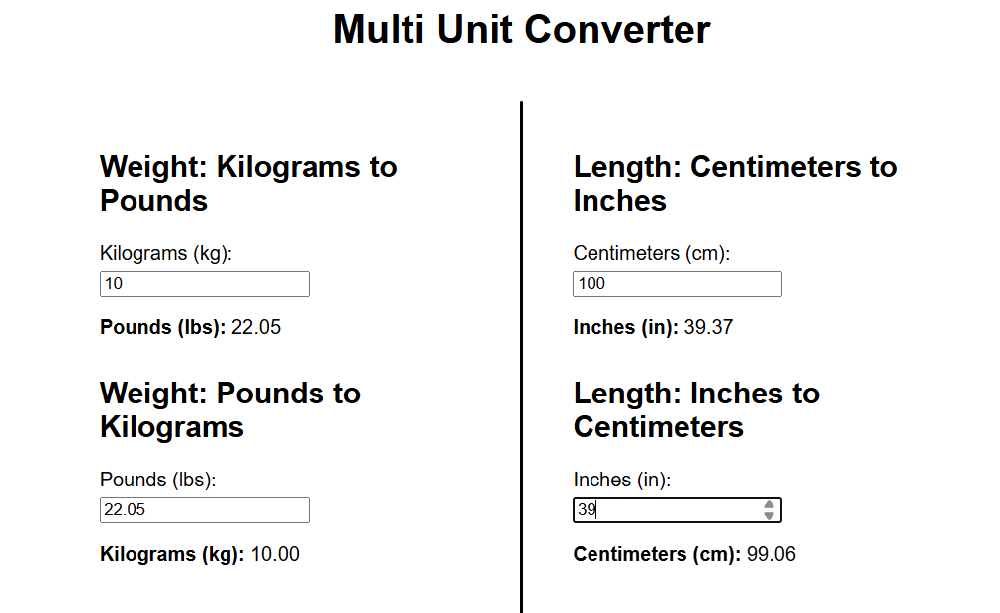

# 🔄 Multi Unit Converter
A clean and responsive web-based unit converter that supports **bi-directional conversion** for both **Weight (Kg ⇄ Lbs)** and **Length (Cm ⇄ Inch)**. Built with plain HTML, CSS, and JavaScript — no frameworks.

## 🌐 Live Preview
🔗 [Click to play the game](https://venkatasateesh8.github.io/convert-kgs-to-lbs-and-viceversa/)

## 📸 Screenshot




## 📁 Files in This Repo
- `index.html`: Main webpage structure
- `style.css`: Styling with Flexbox layout & center divider
- `script.js`: Conversion logic (bi-directional)
- `Multi_Conversions_Page_View1.png`: UI snapshot of the webpage before user enters the values
- `Multi_Conversions_Page_View1.png`: UI snapshot of the webpage after user enters the values and got result
- `README.md`: Documentation and live demo link


## 📋 Technologies Used
- HTML5
- CSS3 (Flexbox layout)
- Vanilla JavaScript

## 🚀 Features
- ✅ Convert **Kilograms ⇄ Pounds**
- ✅ Convert **Centimeters ⇄ Inches**
- 🔄 Vice-versa conversion support
- 🖥️ Split-screen layout (weight conversions on the left, length conversions on the right)
- 📏 Vertical line in the center for visual separation
- ⚡ Real-time conversion as you type
- 🧼 Clean and minimal interface

## 🧠 Future Ideas
- Add Temperature (°C ⇄ °F), Time (minutes ⇄ hours) conversions
- Add unit dropdown selector
- Add dark mode toggle

## 🛠️ How to Use
1. Clone or download the repository:
   ```bash
   git clone https://github.com/VenkataSateesh8/convert-kgs-to-lbs-and-viceversa
